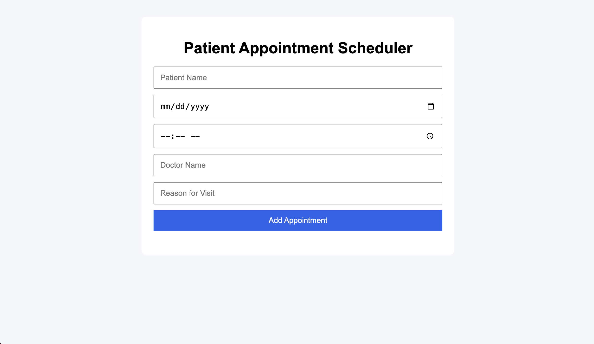

# Patient Appointment Scheduler

## Preview



A full-stack patient appointment scheduling web application built using Node.js, Express.js, JavaScript, HTML, and CSS.

## Features

- Add appointments
- Edit appointments
- Delete appointments
- Dynamic frontend rendering
- REST API backend
- Patient and doctor information tracking

## Technologies Used

- Node.js
- Express.js
- JavaScript
- HTML
- CSS

## How to Run

1. Clone the repository
2. Install dependencies:

```bash
npm install
